```mermaid
graph TD
    CLIENT_REQ["🌐 HTTP Request with Bearer Token"]

    subgraph API["                    🎯 API Layer (CRMBackEnd.API)                    "]
        CTRL["<b>CustomerController</b><br/>GET /api/customer/info/{id}<br/>🎮 REST Endpoint"]
        AUTH["<b>BearerTokenAuthenticationHandler</b><br/>Token: '123'<br/>🔐 Authentication"]
        MID["<b>ExceptionHandlingMiddleware</b><br/>Global Error Handler<br/>⚠️ Error Handling"]
        SWAGGER["<b>Swagger UI</b><br/>/swagger<br/>📚 API Documentation"]
    end

    subgraph APP["              ⚙️ Application Layer (CRMBackEnd.Application)              "]
        SVC["<b>CustomerService</b><br/>Business Logic<br/>🔄 Service"]
        MAP["<b>AutoMapper</b><br/>MappingProfile<br/>🗺️ Object Mapping"]
        DTO["<b>DTOs</b><br/>CustomerInfoResponse<br/>📦 Data Transfer"]
    end

    subgraph DOMAIN["                  🎨 Domain Layer (CRMBackEnd.Domain)                  "]
        INT["<b>Interfaces</b><br/>ICRMServiceClient<br/>📝 Contracts"]
        ENT["<b>Customer Entity</b><br/>Domain Model<br/>📋 Core Model"]
    end

    subgraph INFRA["           🏗️ Infrastructure Layer (CRMBackEnd.Infrastructure)           "]
        CLIENT["<b>CRMServiceClient</b><br/>HTTP Client Wrapper<br/>🔌 Integration"]
        HANDLER["<b>BearerTokenHandler</b><br/>Token Injection<br/>🎫 DelegatingHandler"]
        CONFIG["<b>Configuration</b><br/>ExternalCRMServiceSettings<br/>⚙️ Settings"]
    end

    subgraph External["                         🌐 External Services                         "]
        CRM["<b>External CRM API</b><br/>http://localhost/CRMApi<br/>📡 REST API"]
    end

    %% Request flow top to bottom
    CLIENT_REQ --> CTRL
    CTRL --> AUTH
    CTRL --> MID
    CTRL --> SVC
    
    SVC --> MAP
    SVC --> INT
    
    MAP --> ENT
    MAP --> DTO
    
    INT -.->|"implemented by"| CLIENT
    
    CLIENT --> CONFIG
    CLIENT --> HANDLER
    CLIENT --> CRM

    %% Styling
    classDef apiStyle fill:#4A90E2,stroke:#2E5C8A,stroke-width:3px,color:#fff
    classDef appStyle fill:#7B68EE,stroke:#5B48CE,stroke-width:3px,color:#fff
    classDef domainStyle fill:#FF6B6B,stroke:#DF4B4B,stroke-width:3px,color:#fff
    classDef infraStyle fill:#50C878,stroke:#30A858,stroke-width:3px,color:#fff
    classDef externalStyle fill:#95A5A6,stroke:#75858A,stroke-width:3px,color:#fff
    classDef clientStyle fill:#ECF0F1,stroke:#BDC3C7,stroke-width:2px,color:#2C3E50

    class CTRL,AUTH,MID,SWAGGER apiStyle
    class SVC,DTO,MAP appStyle
    class INT,ENT domainStyle
    class CLIENT,HANDLER,CONFIG infraStyle
    class CRM externalStyle
    class CLIENT_REQ clientStyle
```

## Architecture Overview

### 🎯 Clean Architecture Layers

**API Layer** (Blue) - Entry point and HTTP concerns
- Controllers handle HTTP requests/responses
- Authentication validates bearer tokens
- Middleware handles global error handling
- Swagger provides API documentation

**Application Layer** (Purple) - Business logic and use cases
- Services orchestrate domain operations
- DTOs define data transfer contracts
- AutoMapper handles entity-to-DTO transformations

**Infrastructure Layer** (Green) - External integrations
- HTTP clients communicate with external services
- Handlers inject authentication tokens
- Configuration manages external service settings

**Domain Layer** (Red) - Core business entities and rules
- Entities represent core domain models
- Interfaces define contracts for implementations

### 🔄 Request Flow

1. **HTTP Request** → Incoming request with Bearer token
2. **Authentication** → Token validated against configured value ("123")
3. **Controller** → Parses customer ID from route
4. **Service Layer** → Orchestrates business logic
5. **Infrastructure** → Makes authenticated HTTP call to external CRM API
6. **Mapping** → Transforms Customer entity to CustomerInfoResponse DTO
7. **Response** → Returns JSON response to client

### 🔐 Authentication Flow

- **API Authentication**: Bearer token "123" validated by `BearerTokenAuthenticationHandler`
- **External API**: `BearerTokenHandler` injects token into outgoing HTTP requests

### 📊 Key Design Patterns

- **Clean Architecture**: Dependency inversion, layer separation
- **Repository Pattern**: `ICRMServiceClient` interface
- **Dependency Injection**: All services registered in DI container
- **DTO Pattern**: Separate domain models from API contracts
- **Decorator Pattern**: `BearerTokenHandler` extends HttpClient behavior
