# C4 Model Diagrams

## Level 1: System Context Diagram

```mermaid
graph TB
    User["👤 <b>API Consumer</b><br/>(Person)<br/>External application or user<br/>consuming the API"]
    
    subgraph SystemBoundary[" "]
        CRMBackend["🎯 <b>CRM Backend API</b><br/>(Software System)<br/>Wrapper API providing secure<br/>access to customer data"]
    end
    
    ExternalCRM["📡 <b>External CRM System</b><br/>(External System)<br/>Legacy CRM system<br/>http://localhost/CRMApi"]
    
    User -->|"Makes API requests<br/>with Bearer token"| CRMBackend
    CRMBackend -->|"Fetches customer data<br/>via REST API"| ExternalCRM
    
    classDef personStyle fill:#08427B,stroke:#052E56,stroke-width:3px,color:#fff
    classDef systemStyle fill:#1168BD,stroke:#0B4884,stroke-width:3px,color:#fff
    classDef externalStyle fill:#999999,stroke:#666666,stroke-width:3px,color:#fff
    
    class User personStyle
    class CRMBackend systemStyle
    class ExternalCRM externalStyle
```

### System Context

**CRM Backend API** serves as a secure wrapper around a legacy external CRM system. It provides:
- **Authentication**: Bearer token validation for API consumers
- **Data transformation**: Maps external CRM data to modern API contracts
- **Clean interface**: REST API with Swagger documentation

**Key Relationships:**
- API consumers authenticate with Bearer token "123"
- Backend communicates with external CRM via HTTP REST calls
- External CRM system is maintained separately (http://localhost/CRMApi)

---

## Level 2: Container Diagram

```mermaid
graph TB
    User["👤 <b>API Consumer</b><br/>(Person)"]
    
    subgraph SystemBoundary["                    CRM Backend API System                    "]
        WebAPI["🌐 <b>Web API</b><br/>(ASP.NET Core 8.0)<br/>Provides REST endpoints,<br/>authentication, Swagger UI<br/>Port: 5018 (dev)<br/>/CRMBackend (prod)"]
        
        AppLayer["⚙️ <b>Application Services</b><br/>(C# Class Library)<br/>Business logic, DTOs,<br/>AutoMapper configurations"]
        
        DomainLayer["🎨 <b>Domain Model</b><br/>(C# Class Library)<br/>Core entities, interfaces,<br/>domain contracts"]
        
        InfraLayer["🏗️ <b>Infrastructure</b><br/>(C# Class Library)<br/>HTTP client wrapper,<br/>external service integration"]
    end
    
    ExternalCRM["📡 <b>External CRM API</b><br/>(REST API)<br/>http://localhost/CRMApi"]
    
    User -->|"HTTPS/JSON<br/>Bearer: 123"| WebAPI
    WebAPI -->|"Uses"| AppLayer
    AppLayer -->|"Uses"| DomainLayer
    AppLayer -->|"Depends on"| InfraLayer
    InfraLayer -->|"HTTP GET<br/>/api/v1/ClientData/{id}"| ExternalCRM
    
    classDef personStyle fill:#08427B,stroke:#052E56,stroke-width:3px,color:#fff
    classDef containerStyle fill:#438DD5,stroke:#2E5C8A,stroke-width:3px,color:#fff
    classDef externalStyle fill:#999999,stroke:#666666,stroke-width:3px,color:#fff
    
    class User personStyle
    class WebAPI,AppLayer,DomainLayer,InfraLayer containerStyle
    class ExternalCRM externalStyle
```

### Container Details

**Web API Container** (ASP.NET Core 8.0)
- REST API endpoints (`/api/customer/info/{id}`)
- Bearer token authentication handler
- Global exception handling middleware
- Swagger/OpenAPI documentation
- Deployed to IIS as virtual directory

**Application Services Container** (C# Library)
- `CustomerService` - Business logic orchestration
- `CustomerInfoResponse` - Data transfer objects
- `MappingProfile` - AutoMapper configurations
- Service interfaces and implementations

**Domain Model Container** (C# Library)
- `Customer` - Core entity with JSON serialization attributes
- `ICRMServiceClient` - Repository interface
- Domain contracts and abstractions
- No external dependencies

**Infrastructure Container** (C# Library)
- `CRMServiceClient` - HTTP client implementation
- `BearerTokenHandler` - Token injection for outbound requests
- `ExternalCRMServiceSettings` - Configuration binding
- Integration with external systems

**Technology Stack:**
- Framework: .NET 8.0
- Architecture: Clean Architecture (4 layers)
- HTTP: HttpClient with DelegatingHandler
- Mapping: AutoMapper
- Testing: xUnit, Moq, FluentAssertions

---

## Level 3: Component Diagram

### Component Details

#### Web API Components

**CustomerController**
- **Responsibility**: HTTP endpoint handler
- **Methods**: `GetCustomerInfo(string id)`
- **Dependencies**: `ICustomerService`
- **Returns**: `ActionResult<CustomerInfoResponse>`
- **Error Handling**: Returns 400 for invalid IDs, 500 for server errors

**BearerTokenAuthenticationHandler**
- **Responsibility**: Token validation
- **Validates**: Header matches `Authentication:BearerToken` from config
- **Returns**: 401 Unauthorized if token invalid
- **Type**: `AuthenticationHandler<AuthenticationSchemeOptions>`

**ExceptionHandlingMiddleware**
- **Responsibility**: Global exception handling
- **Catches**: All unhandled exceptions
- **Returns**: JSON error response with status 500
- **Logs**: Exception details for debugging

**Program.cs**
- **Responsibility**: Application bootstrap
- **Configures**: DI container, middleware pipeline, Swagger
- **Registers**: Services, authentication, AutoMapper
- **Setup**: HTTPS redirection, authorization

#### Application Components

**CustomerService**
- **Responsibility**: Business logic orchestration
- **Validation**: Customer ID must be valid integer
- **Dependencies**: `ICRMServiceClient`, `IMapper`
- **Returns**: `CustomerInfoResponse` DTO
- **Error Handling**: Throws `ArgumentException` for invalid IDs

**CustomerInfoResponse**
- **Properties**: ClientId, EditApproval, Dba, ClientLegalName, ComplianceHold, Level, PaymentTermID, PaymentMethod, Status
- **Purpose**: API contract, isolates domain from API concerns
- **Serialization**: JSON (camelCase by default)

**MappingProfile**
- **Responsibility**: Object mapping configuration
- **Maps**: `Customer` → `CustomerInfoResponse`
- **Framework**: AutoMapper
- **Configuration**: CreateMap in constructor

#### Domain Components

**Customer Entity**
- **Properties**: ClientId, EditApproval, Dba, ClientLegalName, ComplianceHold, Level, PaymentTermID, PaymentMethod, Status
- **Attributes**: `[JsonPropertyName]` for camelCase deserialization
- **Dependencies**: None (pure domain)
- **Purpose**: Core business entity

**ICRMServiceClient Interface**
- **Contract**: `Task<Customer> GetClientDataAsync(int clientId)`
- **Purpose**: Abstraction for external CRM access
- **Pattern**: Repository pattern

#### Infrastructure Components

**CRMServiceClient**
- **Responsibility**: External API integration
- **Endpoint**: `GET api/v1/ClientData/{id}` (relative path)
- **Base URL**: Configured in `ExternalCRMServiceSettings`
- **Returns**: Deserialized `Customer` entity
- **Error Handling**: Throws `HttpRequestException` on failure

**BearerTokenHandler**
- **Responsibility**: Token injection for outbound requests
- **Type**: `DelegatingHandler`
- **Adds**: `Authorization: Bearer {token}` header
- **Configuration**: Token from `ExternalCRMServiceSettings`

**ExternalCRMServiceSettings**
- **Properties**: `BaseUrl`, `BearerToken`
- **Binding**: `ExternalCRMService` section from appsettings.json
- **Values**: BaseUrl = "http://localhost/CRMApi/", BearerToken = "123"

**DependencyInjection**
- **Method**: `AddInfrastructure(IServiceCollection, IConfiguration)`
- **Registers**: HttpClient with base address and token handler
- **Configures**: Transient lifetime for handler
- **Binds**: Settings from configuration

### Key Interactions

1. **Request Flow**: User → Controller → AuthHandler → CustomerService → CRMClient → External API
2. **Response Flow**: External API → Customer Entity → Mapper → CustomerInfoResponse DTO → Controller → User
3. **Error Flow**: Any exception → ExceptionMiddleware → JSON error response → User
4. **Token Flow (Inbound)**: Request header → AuthHandler → Validate against config
5. **Token Flow (Outbound)**: CRMClient → TokenHandler → Inject token → External API

---

## Technology Choices

| Component | Technology | Reasoning |
|-----------|-----------|-----------|
| **API Framework** | ASP.NET Core 8.0 | Modern, high-performance, cross-platform |
| **Architecture** | Clean Architecture | Separation of concerns, testability |
| **Authentication** | Bearer Token | Simple, stateless, sufficient for wrapper API |
| **HTTP Client** | HttpClient + DelegatingHandler | Built-in, async, handler pipeline for token injection |
| **Mapping** | AutoMapper | Declarative mapping, reduces boilerplate |
| **DI Container** | Built-in ASP.NET Core | Native, sufficient for application needs |
| **Documentation** | Swagger/OpenAPI | Interactive testing, automatic documentation |
| **Testing** | xUnit + Moq | Industry standard, rich ecosystem |
| **Deployment** | IIS (Virtual Directory) | Integration with existing infrastructure |
