# C4 Model Diagrams

## Level 1: System Context Diagram

```mermaid
graph TB
    User["👤 <b>API Consumer</b><br/>(Person)<br/>External application or user<br/>consuming the API"]
    
    subgraph SystemBoundary[" "]
        CRMBackend["🎯 <b>CRM Backend API</b><br/>(Software System)<br/>Wrapper API providing secure<br/>access to customer data"]
    end
    
    ExternalCRM["📡 <b>External CRM System</b><br/>(External System)<br/>Legacy CRM system<br/>http://localhost/CRMApi"]
    
    User -->|"Makes API requests<br/>with Bearer token"| CRMBackend
    CRMBackend -->|"Fetches customer data<br/>via REST API"| ExternalCRM
    
    classDef personStyle fill:#08427B,stroke:#052E56,stroke-width:3px,color:#fff
    classDef systemStyle fill:#1168BD,stroke:#0B4884,stroke-width:3px,color:#fff
    classDef externalStyle fill:#999999,stroke:#666666,stroke-width:3px,color:#fff
    
    class User personStyle
    class CRMBackend systemStyle
    class ExternalCRM externalStyle
```

### System Context

**CRM Backend API** serves as a secure wrapper around a legacy external CRM system. It provides:
- **Authentication**: Bearer token validation for API consumers
- **Data transformation**: Maps external CRM data to modern API contracts
- **Clean interface**: REST API with Swagger documentation

**Key Relationships:**
- API consumers authenticate with Bearer token "123"
- Backend communicates with external CRM via HTTP REST calls
- External CRM system is maintained separately (http://localhost/CRMApi)

---

## Level 2: Container Diagram

```mermaid
graph TB
    User["👤 <b>API Consumer</b><br/>(Person)"]
    
    subgraph SystemBoundary["                    CRM Backend API System                    "]
        WebAPI["🌐 <b>Web API</b><br/>(ASP.NET Core 8.0)<br/>Provides REST endpoints,<br/>authentication, Swagger UI<br/>Port: 5018 (dev)<br/>/CRMBackend (prod)"]
        
        AppLayer["⚙️ <b>Application Services</b><br/>(C# Class Library)<br/>Business logic, DTOs,<br/>AutoMapper configurations"]
        
        DomainLayer["🎨 <b>Domain Model</b><br/>(C# Class Library)<br/>Core entities, interfaces,<br/>domain contracts"]
        
        InfraLayer["🏗️ <b>Infrastructure</b><br/>(C# Class Library)<br/>HTTP client wrapper,<br/>external service integration"]
    end
    
    ExternalCRM["📡 <b>External CRM API</b><br/>(REST API)<br/>http://localhost/CRMApi"]
    
    User -->|"HTTPS/JSON<br/>Bearer: 123"| WebAPI
    WebAPI -->|"Uses"| AppLayer
    AppLayer -->|"Uses"| DomainLayer
    AppLayer -->|"Depends on"| InfraLayer
    InfraLayer -->|"HTTP GET<br/>/api/v1/ClientData/{id}"| ExternalCRM
    
    classDef personStyle fill:#08427B,stroke:#052E56,stroke-width:3px,color:#fff
    classDef containerStyle fill:#438DD5,stroke:#2E5C8A,stroke-width:3px,color:#fff
    classDef externalStyle fill:#999999,stroke:#666666,stroke-width:3px,color:#fff
    
    class User personStyle
    class WebAPI,AppLayer,DomainLayer,InfraLayer containerStyle
    class ExternalCRM externalStyle
```

### Container Details

**Web API Container** (ASP.NET Core 8.0)
- REST API endpoints (`/api/customer/info/{id}`)
- Bearer token authentication handler
- Global exception handling middleware
- Swagger/OpenAPI documentation
- Deployed to IIS as virtual directory

**Application Services Container** (C# Library)
- `CustomerService` - Business logic orchestration
- `CustomerInfoResponse` - Data transfer objects
- `MappingProfile` - AutoMapper configurations
- Service interfaces and implementations

**Domain Model Container** (C# Library)
- `Customer` - Core entity with JSON serialization attributes
- `ICRMServiceClient` - Repository interface
- Domain contracts and abstractions
- No external dependencies

**Infrastructure Container** (C# Library)
- `CRMServiceClient` - HTTP client implementation
- `BearerTokenHandler` - Token injection for outbound requests
- `ExternalCRMServiceSettings` - Configuration binding
- Integration with external systems

**Technology Stack:**
- Framework: .NET 8.0
- Architecture: Clean Architecture (4 layers)
- HTTP: HttpClient with DelegatingHandler
- Mapping: AutoMapper
- Testing: xUnit, Moq, FluentAssertions

---

## Technology Choices

| Component | Technology | Reasoning |
|-----------|-----------|-----------|
| **API Framework** | ASP.NET Core 8.0 | Modern, high-performance, cross-platform |
| **Architecture** | Clean Architecture | Separation of concerns, testability |
| **Authentication** | Bearer Token | Simple, stateless, sufficient for wrapper API |
| **HTTP Client** | HttpClient + DelegatingHandler | Built-in, async, handler pipeline for token injection |
| **Mapping** | AutoMapper | Declarative mapping, reduces boilerplate |
| **DI Container** | Built-in ASP.NET Core | Native, sufficient for application needs |
| **Documentation** | Swagger/OpenAPI | Interactive testing, automatic documentation |
| **Testing** | xUnit + Moq | Industry standard, rich ecosystem |
| **Deployment** | IIS (Virtual Directory) | Integration with existing infrastructure |
