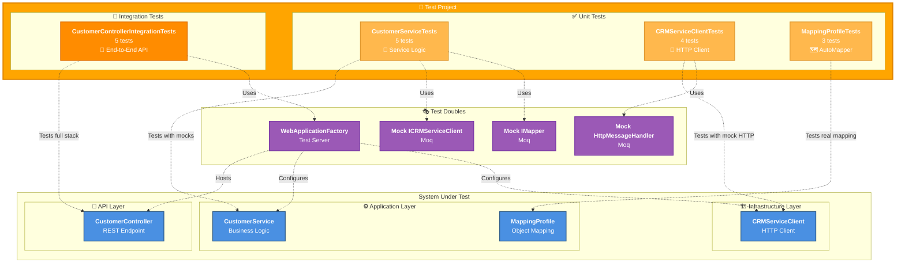

# Testing Architecture



## Testing Strategy

### ✅ Unit Tests (12 tests total)

**CustomerServiceTests** (5 tests)
- ✓ Valid integer ID returns customer info
- ✓ Invalid ID format throws ArgumentException
- ✓ Multiple invalid formats tested (Theory)
- ✓ CRM client exceptions are propagated
- **Mocks**: ICRMServiceClient, IMapper

**CRMServiceClientTests** (4 tests)
- ✓ Successful API call returns customer
- ✓ HTTP errors throw HttpRequestException
- ✓ Bearer token injection verified
- ✓ URL construction validated
- **Mocks**: HttpMessageHandler

**MappingProfileTests** (3 tests)
- ✓ Configuration validation
- ✓ Customer to CustomerInfoResponse mapping
- ✓ All properties mapped correctly
- **Uses**: Real AutoMapper instance

### 🔗 Integration Tests (5 tests)

**CustomerControllerIntegrationTests** (5 tests)
- ✓ Valid request returns 200 OK with customer data
- ✓ Invalid ID format returns 400 Bad Request
- ✓ Missing authentication returns 401 Unauthorized
- ✓ Invalid token returns 401 Unauthorized
- ✓ Full request/response validation
- **Uses**: WebApplicationFactory (in-memory test server)

### 🎯 Test Coverage

| Layer | Coverage | Tests |
|-------|----------|-------|
| **Application** | High | 5 unit + 5 integration |
| **Infrastructure** | High | 4 unit |
| **API** | High | 5 integration |
| **Domain** | Implicit | Via mapping tests |

### 🛠️ Testing Tools

- **xUnit 3.1.4**: Test framework
- **Moq 4.20.72**: Mocking library
- **FluentAssertions 8.8.0**: Assertion library
- **Microsoft.AspNetCore.Mvc.Testing 10.0.0**: Integration testing

### 📊 Test Results

```
Test summary: total: 19, failed: 0, succeeded: 19, skipped: 0
Duration: ~4s
```

### 🔍 Testing Patterns

**Arrange-Act-Assert (AAA)**
```csharp
// Arrange - Set up test data and mocks
var customerId = "12345";
_mockCrmClient.Setup(x => x.GetClientDataAsync(12345)).ReturnsAsync(customer);

// Act - Execute the method under test
var result = await _sut.GetCustomerInfoAsync(customerId);

// Assert - Verify the results
result.Should().NotBeNull();
result.ClientId.Should().Be(customerId);
```

**Theory Tests** - Data-driven tests
```csharp
[Theory]
[InlineData("")]
[InlineData("abc")]
[InlineData("12.34")]
public async Task MultipleInputs_ThrowsException(string invalidId)
```

**Integration Tests** - Full HTTP pipeline
```csharp
var response = await _client.GetAsync("/api/customer/info/12345");
response.StatusCode.Should().Be(HttpStatusCode.OK);
```
